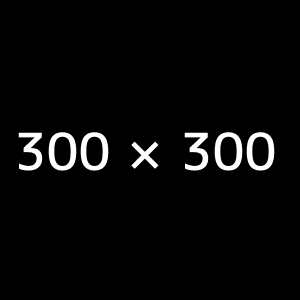

carousel-example
================

Carousel example by using css and javascript

This is second version which does not depend on jQuery but uses CSS transition.

Current version supports only 3 images sliding.

Carousel will take full size of parent

Usage
=====

1. Import croxuel.css and Croxuel.js

2. Use HTML structure: 
            <ul id="croxuel">
                <li class="left"></li>
                <li class="active"></li>
                <li class="right"></li>
            </ul>

3. Invoke Croxuel.init();

Manual sliding invocation
=========================

To slide left use Croxuel.slideLeft()

To slide right use Croxuel.slideRight()

Sliding with left and right arrows
==================================

If You want to be able to slide with arrows add data-arrow_control to ul tag

Example: <ul id="croxuel" data-arrow_control>...</ul>

Sliding with buttons
==================================

If You want to be able to slide with buttons add data-button_control to ul tag 
and data-croxuel_left_button or data-croxuel_right_button to buttons

Example: 
	<ul id="croxuel" data-button_control>...</ul>
	<button data-croxuel_left_button>left</button>
	<button data-croxuel_right_button>right</button>
