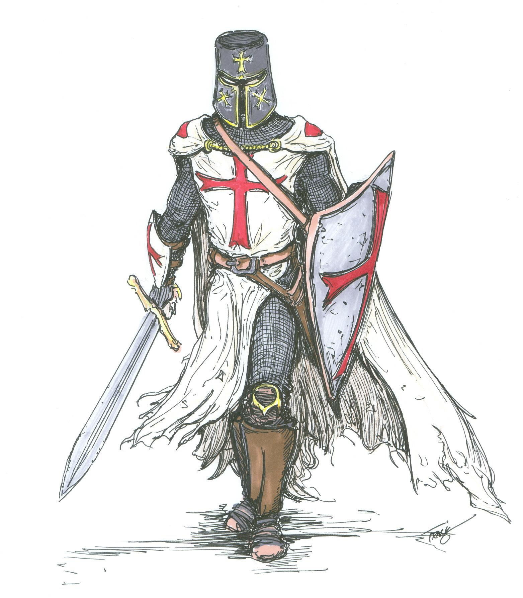

carousel-example
================

Carousel example by using css and javascript. 

Example is in demo folder and minified versions are in dist folder.

It uses pure JavaScript and CSS transition.

Carousel will take full size of parent tag.

Grunt has task min which minifies css and js.

Usage
=====

1. Import croxuel.css and Croxuel.js

2. Use HTML structure: 
```html
            <ul id="croxuel">
                <li class="left"></li>
                <li class="active"></li>
                <li class="right"></li>
                <li class="right"></li>
                <li class="right"></li>
                <li class="right"></li>
                <li class="right"></li>
            </ul>
```

3. Invoke Croxuel.init();


Manual sliding invocation
=========================

To slide left use Croxuel.slideLeft()

To slide right use Croxuel.slideRight()


Sliding with left and right arrows
==================================

If You want to be able to slide with arrows add data-arrow_control to ul tag

Example: 
```html
<ul id="croxuel" data-arrow_control>...</ul>
```

Sliding with buttons
==================================

If You want to be able to slide with buttons add data-button_control to ul tag 
and data-croxuel_left_button or data-croxuel_right_button to buttons

Example: 
```html
	<ul id="croxuel" data-button_control>...</ul>
	<button data-croxuel_left_button>left</button>
	<button data-croxuel_right_button>right</button>
```

TODO
====
1. Adding active, left and right classes to li on init.

2. Add opacity animation

3. Refactor code

